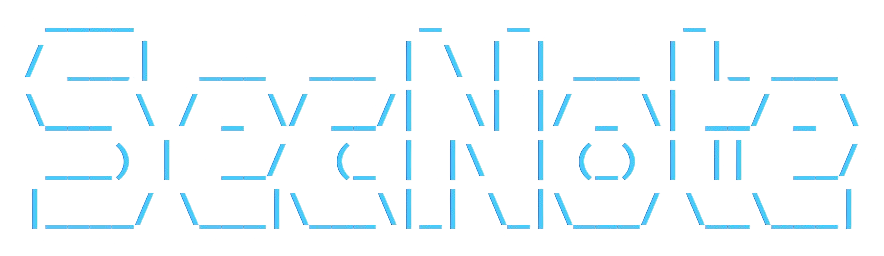

# S3cN0te

## What is S3cN0te?

**SecNote** *(in leetspeak: "S3cN0te")* is a browser-based **Markdown-Editor**.  
By running the ``notesec.exe or main.py`` the applicatition is beeing **self-hosted** by default on ``localhost:55555`` defined in ``config.json``. The frontend is build with html, js, css + additional librarys for style and functionality ``mustache.min.js bootstrap.min.js bootstrap.min.css marked.min.js purify.min.js``.  
The backend-API is build with ``python-Flask`` and features **login/register-behaviour** via ``duckdb`` and **image + PDF - generation** via ``playwright``.  

**SecNote** lets you create secure notes in Markdown-format localy and encrypted with a secure password of your choice. The core functionality is stript down to your own device, which reduces the risk of data exfiltration via the internet.
Additionaly one can convert these slides-like notes to a presentable fileformat like .png or .pdf.  
> For convertation playwright uses, but isn't limited to the bootstrap-cdn, which is the only online dependecy for style reasons!

## Installation

## Usage

## Assets

> This section's purpose is to give credits to the artists of the free icons, that i used for the GUI-design.  
> The reference-links to the flaticons were copied at download from the official website!

Github:

* [Github - Icon](https://brand.github.com/foundations/logo)

meaicon - Flaticon:

* [Content - icons](https://www.flaticon.com/free-icons/content)
* [Document - icons](https://www.flaticon.com/free-icons/document)

Freepik - Flaticon:

* [Share - icons](https://www.flaticon.com/free-icons/share)
* [Download pdf - icons](https://www.flaticon.com/free-icons/download-pdf)

joalfa - Flaticon:

* [Return on investment - icons](https://www.flaticon.com/free-icons/return-on-investment)
* [Miscellaneous - icons](https://www.flaticon.com/free-icons/miscellaneous)

Stockio - Flaticon

* [X - icons](https://www.flaticon.com/free-icons/x)

HideMaru - Flaticon

* [Add-document - icons](https://www.flaticon.com/free-icons/add-document)

Uniconlabs - Flaticon

* [Download - icons](https://www.flaticon.com/free-icons/download)

SeyfDesigner

* [Gallery - icons](https://www.flaticon.com/free-icons/gallery)
