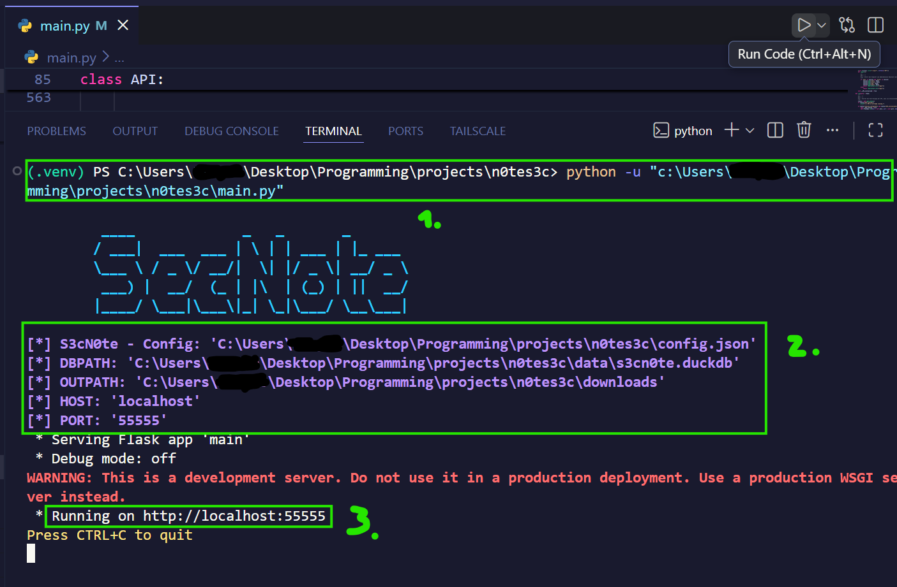
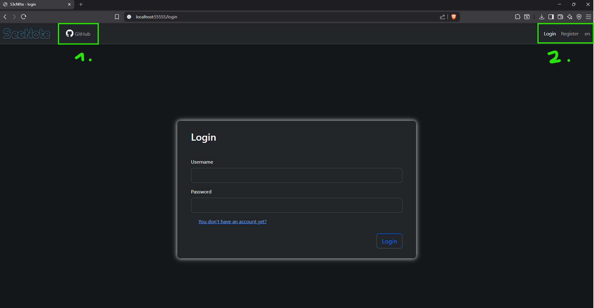
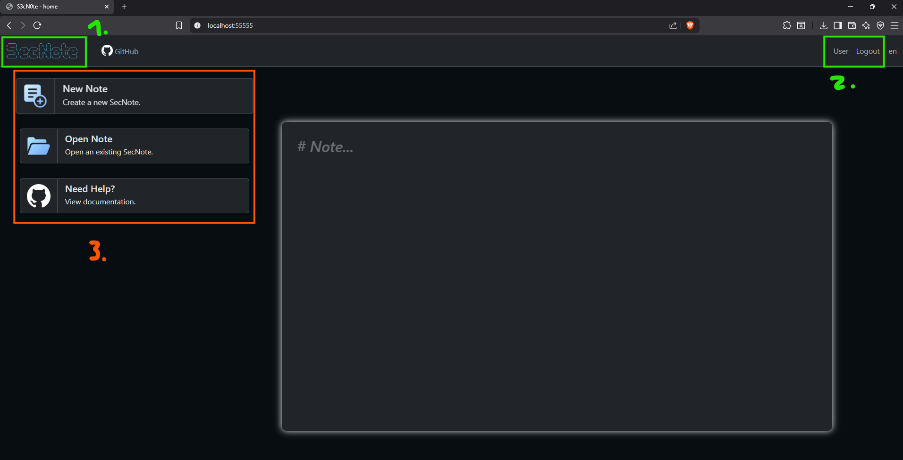
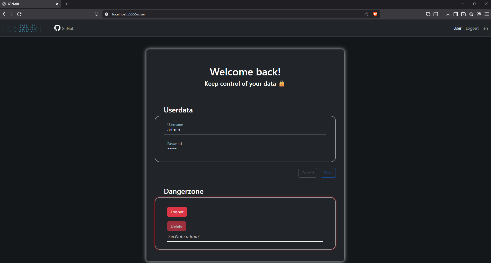
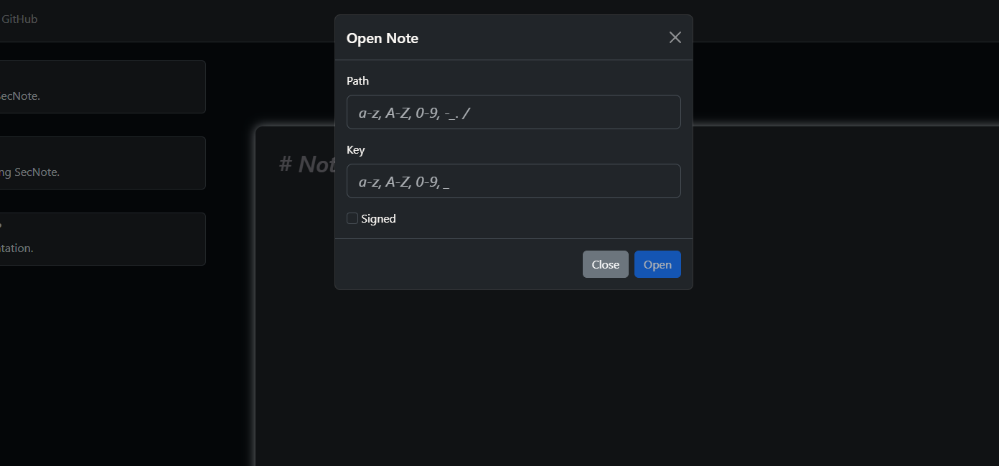
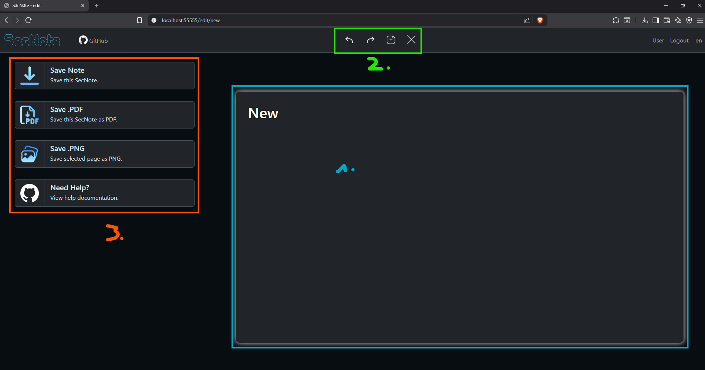
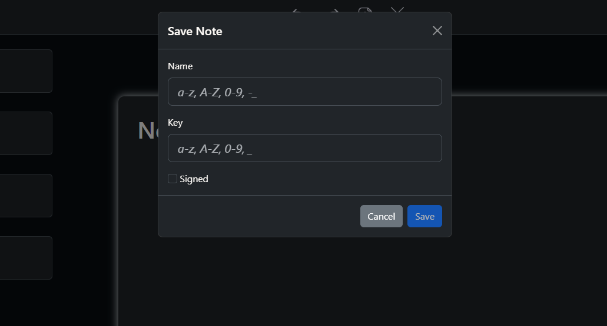

# S3cN0te


## What is S3cN0te?

**SecNote** *(in leetspeak: "S3cN0te")* is a browser-based **Markdown editor**.  
By running the ``notesec.exe`` or ``main.py``, the application is **self-hosted** by default on ``localhost:55555``, as defined in ``config.json``. The frontend is built with HTML, JS, CSS, plus additional libraries for styling and functionality: ``mustache.min.js``, ``bootstrap.min.js``, ``bootstrap.min.css``, ``marked.min.js``, ``purify.min.js``.  
The backend API is built with **Python Flask** and features **login and register functionality** via ``DuckDB``, as well as **image and PDF generation** via ``playwright``.  

**SecNote** lets you create secure notes in Markdown format locally, encrypted with a  password of your choice. The core functionality is stripped down to your own device, which reduces the risk of data exfiltration over the internet.  
Additionally, you can convert these slide-like notes into presentable file formats such as ``.png`` or ``.pdf``.  
> For conversion, Playwright uses (but is not limited to) the Bootstrap CDN, which is the only online dependency for styling purposes.

## Installation

Download the [latest released](https://github.com/2Sn00py4u/S3cN0te/releases) binary or install via ``python -m venv``:  
> Note use Python >= 3.12.5

### Mac/Linux

```bash
# virtual environment
python3 -m venv .venv
source .venv/bin/activate

# install requirements
python3 -m pip install -r requirements.txt

# install playwright
playwrigth install
```

### Windows

```ps1
# virtual environment
python.exe -m venv .venv
& .venv\Scripts\Activate.ps1

# install requirements
python.exe -m pip install -r requirements.txt

# install playwright
playwrigth install
```

Or just download the latest release .zip file

## Usage

### 1. Starting the application



1. Run the ``main.py`` in the virtual environement or execute the ``notesec.exe``
2. The current configurations; You can change them in the ``config.json``
3. The URL at which the app is hosted

***Open your browser of choice and visit the URL. In this case: ``http://localhost:55555``***

### 2. The application panel (no login)



1. A link to the GitHub source code
2. Authentication and language
   1. Login if you have an account
   2. Register to create an account
   3. Change the language between English and German

***For authentication you can either use ``admin:admin`` or create your own account***
> Note: All user credentials are stored and AES-encrypted in ``s3cn0te.duckdb``

### 3. The application panel (login)



1. A link to the main menu *(current)*
2. User profile and Logout
   1. User profile tab to change or delete your account
        
   2. Log out from the current session
3. Options
   1. Create a new SecNote
   2. Open an existing SecNote
        
        > The ***signed*** option uses an encryption specific to the user account, so nobody except the user can read it
   3. [View usable Markdown elements](https://github.com/2Sn00py4u/S3cN0te/blob/main/CreateSecNotes.md)

### 4. Editing a SecNote



1. This is a Markdown SecNote slide
2. Editor options
   1. **Undo**
   2. **Redo**
   3. **Add** a next slide
   4. **Delete** the currently selected *(clicked)* slide
3. Options
   > Note: every file is saved in the default ``outpath`` defined in ``config.json``
   1. Save as a secure ``.secnote`` file
        
        > The ***signed*** option uses an encryption specific to the user account, so nobody except the user can read it
   2. Save all slides as a single ``.pdf`` file
   3. Save the currently selected *(clicked)* slide as a ``.png`` file
   4. [View usable Markdown elements](https://github.com/2Sn00py4u/S3cN0te/blob/main/CreateSecNotes.md)

## Assets

> This section gives credit to the artists of the free icons used in the GUI design.  
> The reference links to the Flaticon resources were copied from the official website at the time of download.

GitHub:

* [GitHub - Icon](https://brand.github.com/foundations/logo)

meaicon - Flaticon:

* [Content - icons](https://www.flaticon.com/free-icons/content)
* [Document - icons](https://www.flaticon.com/free-icons/document)

Freepik - Flaticon:

* [Share - icons](https://www.flaticon.com/free-icons/share)
* [Download pdf - icons](https://www.flaticon.com/free-icons/download-pdf)

joalfa - Flaticon:

* [Return on investment - icons](https://www.flaticon.com/free-icons/return-on-investment)
* [Miscellaneous - icons](https://www.flaticon.com/free-icons/miscellaneous)

Stockio - Flaticon

* [X - icons](https://www.flaticon.com/free-icons/x)

HideMaru - Flaticon

* [Add-document - icons](https://www.flaticon.com/free-icons/add-document)

Uniconlabs - Flaticon

* [Download - icons](https://www.flaticon.com/free-icons/download)

SeyfDesigner

* [Gallery - icons](https://www.flaticon.com/free-icons/gallery)
